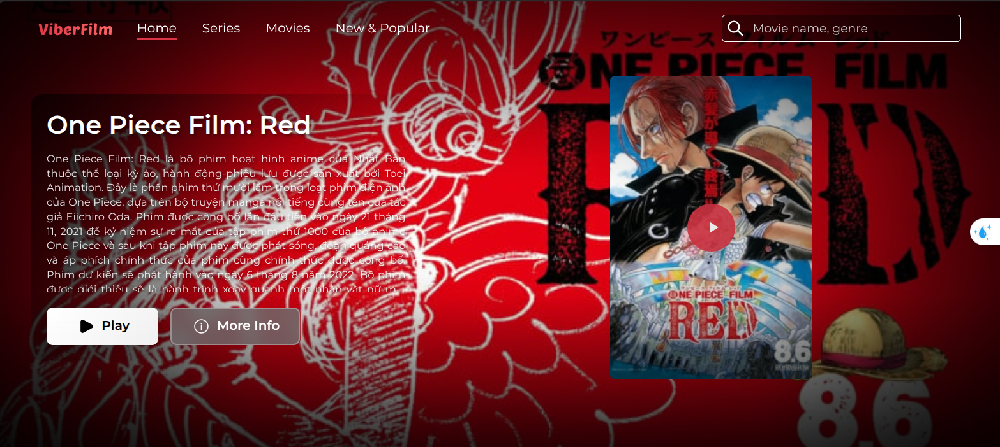

# ViberFilm - Video Streaming Platform (Django & React)



ViberFilm is a simple and lightweight full-stack video streaming platform that allows users to browse and watch movies and TV series for free. Built with Django REST Framework and ReactJS, it provides basic but essential features such as trending movies, detailed film info, episode lists, and video streaming using HLS (HTTP Live Streaming). An admin panel is also provided to manage content easily. This application is deployed using docker and nginx.

**Live Application URL:** [Coming Soon]
_(The application will be deployed with frontend on port 3000, admin panel on port 3001, and backend API on port 8000.)_

## 🎬 Key Features

### 🎞️ Movie & Series Browsing

- **Trending Movies**: Displays the most viewed movies and series in recent days.
- **New Releases**: Browse newly added content.
- **Categories & Genres**: Filter content by genre, release year, or category.

### 🔍 Search

- **Quick Search**: Find movies or TV shows by title.
- **Autocomplete Suggestions**: Helps users find what they’re looking for quickly (optional).

### 📄 Movie & Episode Details

- **Movie Information**: View description, subtitle availability, category, release date, etc.
- **Season & Episodes**: Structured listing of episodes under seasons.

### 🎥 HLS Video Streaming

- **Adaptive Streaming**: Uses HLS (HTTP Live Streaming) for smooth playback across devices and varying network speeds.
- **Bandwidth Efficient**: Automatically adjusts video quality to optimize bandwidth and viewing experience.

### 🔧 Admin Panel

- **Manage Content**: Add, edit, or delete movies, series, and episodes easily.
- **Subtitle Upload**: Attach subtitles to videos for multilingual support.
- **Media Management**: Upload and update video files through the panel.

## 🛠️ Tech Stack

- **Backend**: Django + Django REST Framework
- **Frontend**: ReactJS
- **Video Streaming**: FFmpeg for HLS conversion
- **Database**: MySQL 8
- **Containerization**: Docker & Docker Compose
- 
## 🛠️ Tech Stack

- **Backend:**
  - Framework: Django (Python)
  - API: Django REST Framework
  - Authentication: JWT (JSON Web Tokens)
- **Frontend & Admin Panel:**
  - Library: ReactJS
  - UI Framework: Material-UI
  - State Management: React Context API
- **Database:** MySQL 8.0
- **Search Engine:** Elasticsearch
- **Caching & Message Broker:** Redis
- **Video Processing:** FFmpeg (for HLS conversion)
- **Containerization:** Docker, Docker Compose
- **Deployment:** Docker with automated scripts

## 🚀 Getting Started (Local Development)

These instructions will get you a copy of the project up and running on your local machine for development and testing purposes.

### Prerequisites

- Git
- Docker & Docker Compose
- Node.js & npm (if you intend to run frontend/admin outside Docker for development)
- Python 3.9+ & pip (if you intend to run backend outside Docker for development)

### Installation with Docker

This is the recommended way to run the entire stack locally using our automated Docker management script.

1.  **Clone the repository:**

    ```bash
    git clone <repository-url>
    cd viberfilm
    ```

2.  **Configure Environment Variables:**
    
    Copy the environment template and configure with your settings:

    ```bash
    cp .env.example .env
    ```

    **Configure your `.env` file with appropriate values:**

    ```env
    # ============================================================================
    # ENVIRONMENT SETTINGS
    # ============================================================================
    ENVIRONMENT=development
    DEBUG=True
    SECRET_KEY=your-django-secret-key-change-this-in-production

    # ============================================================================
    # SERVER & NETWORK CONFIGURATION
    # ============================================================================
    SERVER_IP=127.0.0.1
    SERVER_PORT=8000
    FRONTEND_PORT=3000
    ADMIN_PORT=3001
    ALLOWED_HOSTS=localhost,127.0.0.1,your-domain.com

    # ============================================================================
    # DATABASE CONFIGURATION
    # ============================================================================
    MYSQL_ROOT_PASSWORD=your-mysql-root-password
    MYSQL_DATABASE=viberfilm_database
    MYSQL_USER=viberfilm_user
    MYSQL_PASSWORD=your-mysql-password
    MYSQL_HOST=db
    MYSQL_PORT=3306

    # Database connection for Django
    DB_NAME=${MYSQL_DATABASE}
    DB_USER=${MYSQL_USER}
    DB_PASSWORD=${MYSQL_PASSWORD}
    DB_HOST=${MYSQL_HOST}
    DB_PORT=${MYSQL_PORT}

    # ============================================================================
    # REDIS CONFIGURATION
    # ============================================================================
    REDIS_URL=redis://redis:6379/0
    REDIS_HOST=redis
    REDIS_DB=0

    # ============================================================================
    # ELASTICSEARCH CONFIGURATION
    # ============================================================================
    ELASTICSEARCH_HOST=elasticsearch
    ELASTICSEARCH_PORT=9200
    ELASTIC_HOST=http://${ELASTICSEARCH_HOST}:${ELASTICSEARCH_PORT}
    ELASTIC_USERNAME=elastic
    ELASTIC_PASSWORD=your-elasticsearch-password

    # ============================================================================
    # EMAIL CONFIGURATION
    # ============================================================================
    EMAIL_BACKEND=django.core.mail.backends.smtp.EmailBackend
    EMAIL_HOST=smtp.gmail.com
    EMAIL_PORT=587
    EMAIL_USE_TLS=True
    EMAIL_HOST_USER=your-email@gmail.com
    EMAIL_HOST_PASSWORD=your-app-password
    DEFAULT_FROM_EMAIL=${EMAIL_HOST_USER}

    # ============================================================================
    # ADMIN USER CREDENTIALS
    # ============================================================================
    DJANGO_SUPERUSER_USERNAME=admin
    DJANGO_SUPERUSER_EMAIL=admin@yourdomain.com
    DJANGO_SUPERUSER_PASSWORD=your-admin-password

    # ============================================================================
    # JWT CONFIGURATION
    # ============================================================================
    JWT_ACCESS_TOKEN_LIFETIME=60
    JWT_REFRESH_TOKEN_LIFETIME=10080
    JWT_ROTATE_REFRESH_TOKENS=True
    JWT_BLACKLIST_AFTER_ROTATION=True
    ```

3.  **Build and Run with Docker Compose:**
    From the root directory of the project (where `docker-compose.yml` is located):

    ```bash
    docker-compose up --build -d
    ```

    - `--build`: Forces a rebuild of the images if they've changed.
    - `-d`: Runs containers in detached mode.
  4.  **Apply Backend Migrations (if not handled by an entrypoint script in your Docker setup):**

    ```bash
    docker-compose exec <backend_service_name> python manage.py makemigrations
    docker-compose exec <backend_service_name> python manage.py migrate
    ```

    (Replace `<backend_service_name>` with the name of your Django service in `docker-compose.yml`, e.g., `backend` or `viberstore_backend`).

    You might also need to create a superuser:

    ```bash
    docker-compose exec <backend_service_name> python manage.py createsuperuser
    ```

5.  **Access the application:**
    
    Once all services are running:
    - **Frontend (User Interface):** `http://localhost:3000`
    - **Admin Panel:** `http://localhost:3001`
    - **Backend API:** `http://localhost:8000`
    - **API Documentation:** `http://localhost:8000/api/docs/`


## 🔄 Data Management

### Backup System

The project includes an automated backup system:

```bash
# Create backup
./backup-database.sh

# This creates a timestamped backup in backups/ directory containing:
# - Database dump
# - Media files
# - Configuration files
```

### Adding Content

1. **Via Admin Panel:**
   - Upload video files through the admin interface
   - Add metadata (title, description, cast, genre, etc.)
   - System automatically processes videos for streaming

2. **Via API:**
   - Use REST endpoints to programmatically add content
   - Bulk upload capabilities for large content libraries

## 🤝 Contributing

Contributions are welcome! If you'd like to contribute, please follow these steps:

1.  Fork the Project
2.  Create your Feature Branch (`git checkout -b feature/AmazingFeature`)
3.  Commit your Changes (`git commit -m 'Add some AmazingFeature'`)
4.  Push to the Branch (`git push origin feature/AmazingFeature`)
5.  Open a Pull Request

## 📜 License

Distributed under the MIT License. See `LICENSE` file for more information.
_(Create a `LICENSE` file in your root directory with the MIT license text if you don't have one.)_

---

**Author:** Van Diep Tran
**GitHub:** https://github.com/trandiepp2105
